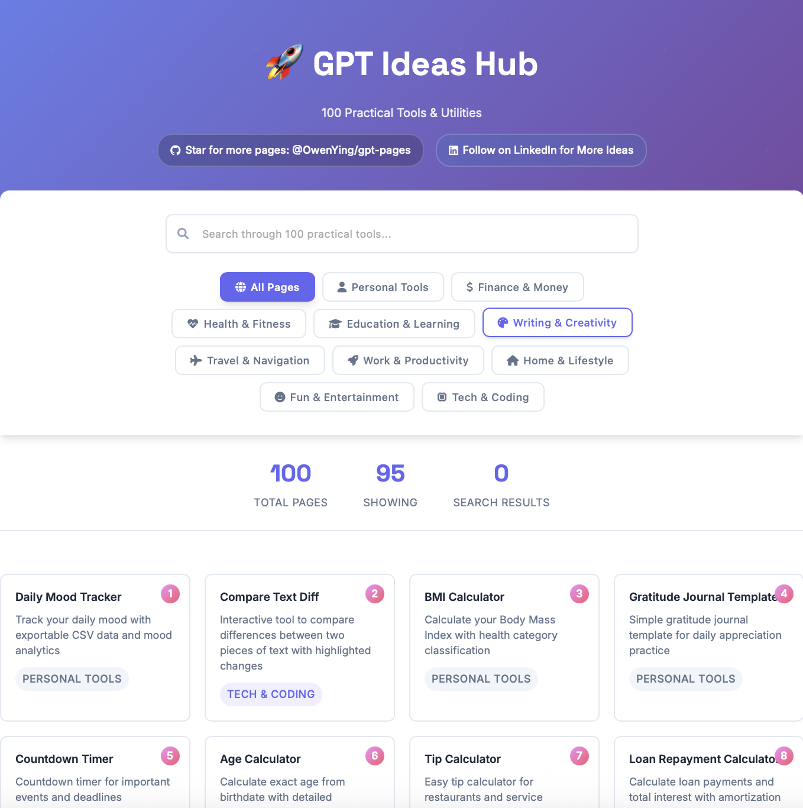

# 🚀 [GPT Ideas Hub](https://gpt-pages.com)

<p align="center">
  
</p>


## ✨ How this happens? -- Only three prompts
"Can you brainstorm 100 useful ideas that can be used via 1-page static pages? "

"Can you implement each of them as a 1-pager static page?"

"Keep implementing this list, if it doesn't exist already, in the same way as the old pages, until all finishes. Add them to home page. Don't ask me in between"

Boom!! 💥💥💥💥💥

A curated collection of **100 practical, single-page web tools** built with vanilla HTML, CSS, and JavaScript. Each tool is designed to solve a specific everyday problem with a clean, intuitive interface.

To add a new page: 
"Add a new "guitar tuner" page, make it consistent with previous pages."

## ✨ What's Included

**100 Complete Tools** across 10 categories:

### 🧰 Personal Tools
- Daily mood tracker with CSV export
- Gratitude journal template
- BMI calculator
- Countdown timer
- Age calculator
- Tip calculator
- Loan repayment calculator
- Daily habit checklist
- Time zone converter
- Text comparison tool

### 💰 Finance & Money
- Currency converter
- Compound interest calculator
- Paycheck tax estimator
- Credit card payoff calculator
- Budget allocation pie chart
- Savings goal tracker
- Cost per use calculator
- Inflation-adjusted value calculator
- Retirement savings projection
- Side-hustle income tracker

### ❤️ Health & Fitness
- Calorie needs calculator (TDEE)
- Simple workout generator
- Water intake tracker
- Step goal visualizer
- Sleep debt calculator
- Heart rate zone calculator
- Yoga pose library
- Stretch reminder timer
- Exercise log sheet
- Walking pace calculator

### 📚 Education & Learning
- Flashcard study tool
- Vocabulary word of the day
- Typing speed tester
- Reading time estimator
- Math problem generator
- Periodic table reference
- Language pronunciation guide
- Capital cities quiz
- Historical timeline viewer
- Spaced repetition scheduler

### ✍️ Writing & Creativity
- Random writing prompt generator
- Character name generator
- Poem/haiku creator
- Story plot idea generator
- Markdown editor
- Daily journaling template
- Color palette generator
- Emoji art creator
- Logo idea randomizer
- Mood board template

### ✈️ Travel & Navigation
- Packing checklist generator
- Route map with Google Maps
- World clock for travelers
- Local weather forecast
- Sunrise/sunset finder
- Currency cheat sheet
- Visa requirement checker
- Emergency contact sheet
- Public transportation maps
- Travel budget calculator

### ⚡ Work & Productivity
- Pomodoro timer
- Resume/CV PDF generator
- Invoice creator
- Business card designer
- Work hours tracker
- Gantt chart generator
- Client onboarding checklist
- Idea backlog tracker
- Email template library

### 🏠 Home & Lifestyle
- Weekly meal planner
- Grocery list generator
- Chore schedule template
- Home budget tracker
- Plant watering schedule
- Recipe scaling calculator
- Home maintenance checklist
- Pet care schedule
- Pantry inventory list
- Bill split calculator

### 🎉 Fun & Entertainment
- Daily trivia questions
- Random joke generator
- Simple meme maker
- Movie night picker
- Book recommendation randomizer
- Song lyric finder
- Quote of the day
- "Would You Rather" questions
- Party game rules reference
- Mini pixel art canvas

### 💻 Tech & Coding
- QR code generator
- URL shortener
- Regex tester
- JSON formatter
- HTML color picker
- Git command cheatsheet
- HTTP status code reference
- CSS gradient generator
- ASCII art generator
- Password strength tester

## 🚀 Key Features

- **Instant Access**: No downloads, no installations - just open and use
- **Mobile Optimized**: Responsive design that works on any device
- **Lightning Fast**: Pure static files load instantly
- **Offline Ready**: Works without internet connection
- **No Dependencies**: Built with vanilla web technologies
- **Easy to Deploy**: Can be hosted on any web server or CDN

## 🌐 Live Demo

Visit the live site: [GPT Ideas Hub](https://gpt-pages.com)

## 🛠️ Local Development

1. **Clone the repository**
   ```bash
   git clone https://github.com/OwenYing/gpt-pages.git
   cd gpt-pages
   ```

2. **Start local server**
   ```bash
   python3 -m http.server 8000
   # or
   npx serve .
   ```

3. **Open in browser**
   ```
   http://localhost:8000
   ```

## 📁 Project Structure

```
gpt-static-pages/
├── index.html              # Main home page with all 100 tools
├── styles.css              # Global styles and design system
├── script.js               # Main application logic and tool data
├── pages/                  # Individual tool pages (100 total)
│   ├── 1-daily-mood-tracker.html
│   ├── 2-compare-text-diff.html
│   ├── 3-bmi-calculator.html
│   └── ... (100 total)
└── README.md
```

## 🤝 Contributing

Contributions are welcome!   
Create a github issue for bug or more pages, gpt will fix it!

## 📄 License

This project is open source and available under the [MIT License](LICENSE).

## 🙏 About the Creator

**Owen Ying** - A developer who is exploring AI world. 

- **LinkedIn**: [Tiancheng Ying](https://www.linkedin.com/in/tianchengying/)
- **GitHub**: [@OwenYing](https://github.com/OwenYing)

## 🎯 Project Goals

This project was created to demonstrate that you don't need complex frameworks or heavy dependencies to build useful, professional web applications. Each tool is a testament to the power of vanilla web technologies and thoughtful design.

---

**Built with ❤️ and powered by AI creativity**
