# Test Mermaid Diagram

Here's a comprehensive test diagram that showcases various Mermaid features:

## Flowchart Example
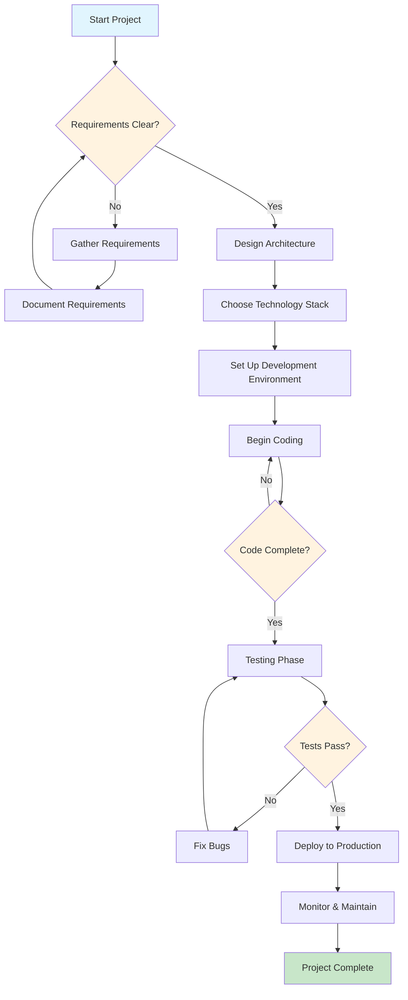
```mermaid
graph TD
    A[Start Project] --> B{Requirements Clear?}
    B -->|Yes| C[Design Architecture]
    B -->|No| D[Gather Requirements]
    D --> E[Document Requirements]
    E --> B
    C --> F[Choose Technology Stack]
    F --> G[Set Up Development Environment]
    G --> H[Begin Coding]
    H --> I{Code Complete?}
    I -->|No| H
    I -->|Yes| J[Testing Phase]
    J --> K{Tests Pass?}
    K -->|No| L[Fix Bugs]
    L --> J
    K -->|Yes| M[Deploy to Production]
    M --> N[Monitor & Maintain]
    N --> O[Project Complete]
    
    style A fill:#e1f5fe
    style O fill:#c8e6c9
    style B fill:#fff3e0
    style I fill:#fff3e0
    style K fill:#fff3e0
```

## Sequence Diagram Example
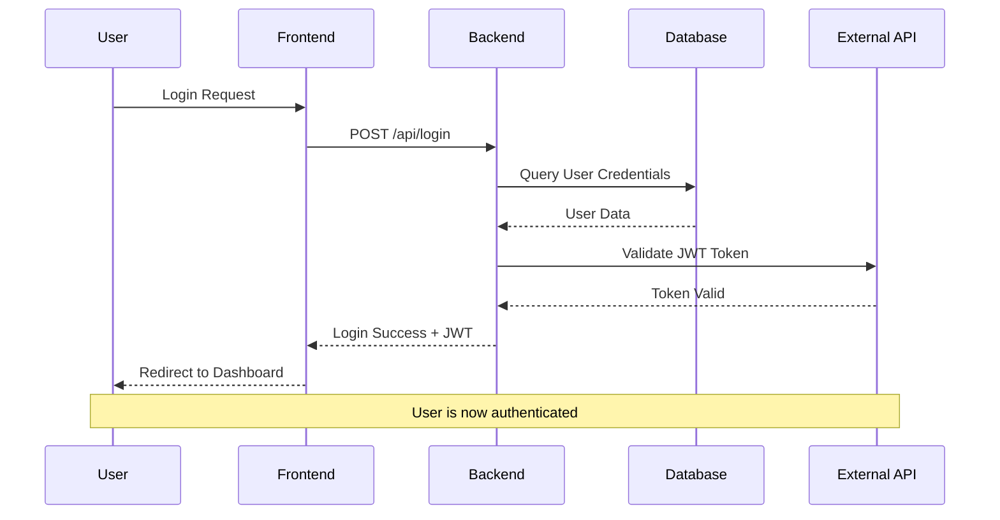
```mermaid
sequenceDiagram
    participant U as User
    participant F as Frontend
    participant B as Backend
    participant D as Database
    participant E as External API
    
    U->>F: Login Request
    F->>B: POST /api/login
    B->>D: Query User Credentials
    D-->>B: User Data
    B->>E: Validate JWT Token
    E-->>B: Token Valid
    B-->>F: Login Success + JWT
    F-->>U: Redirect to Dashboard
    
    Note over U,E: User is now authenticated
```

## Class Diagram Example
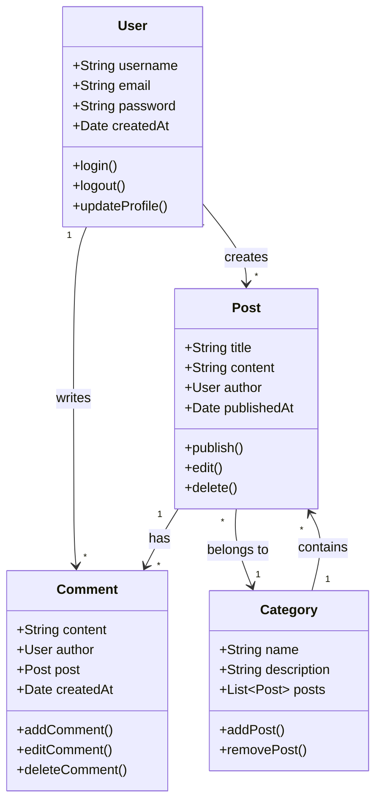
```mermaid
classDiagram
    class User {
        +String username
        +String email
        +String password
        +Date createdAt
        +login()
        +logout()
        +updateProfile()
    }
    
    class Post {
        +String title
        +String content
        +User author
        +Date publishedAt
        +publish()
        +edit()
        +delete()
    }
    
    class Comment {
        +String content
        +User author
        +Post post
        +Date createdAt
        +addComment()
        +editComment()
        +deleteComment()
    }
    
    class Category {
        +String name
        +String description
        +List~Post~ posts
        +addPost()
        +removePost()
    }
    
    User "1" --> "*" Post : creates
    User "1" --> "*" Comment : writes
    Post "1" --> "*" Comment : has
    Category "1" --> "*" Post : contains
    Post "*" --> "1" Category : belongs to
```

## Gantt Chart Example
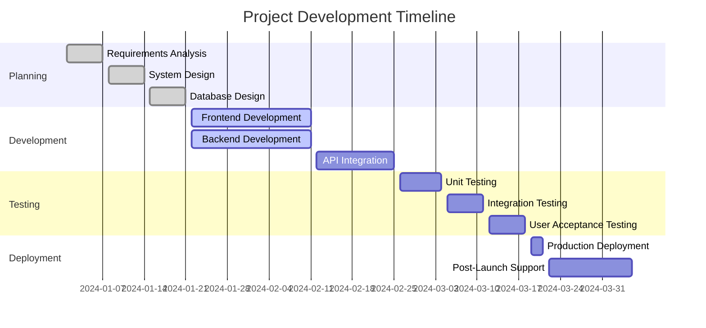
```mermaid
gantt
    title Project Development Timeline
    dateFormat  YYYY-MM-DD
    section Planning
    Requirements Analysis    :done, req, 2024-01-01, 2024-01-07
    System Design          :done, design, 2024-01-08, 2024-01-14
    Database Design        :done, db, 2024-01-15, 2024-01-21
    
    section Development
    Frontend Development   :active, frontend, 2024-01-22, 2024-02-11
    Backend Development    :active, backend, 2024-01-22, 2024-02-11
    API Integration       :api, 2024-02-12, 2024-02-25
    
    section Testing
    Unit Testing          :test, 2024-02-26, 2024-03-04
    Integration Testing   :test, 2024-03-05, 2024-03-11
    User Acceptance Testing :test, 2024-03-12, 2024-03-18
    
    section Deployment
    Production Deployment  :deploy, 2024-03-19, 2024-03-21
    Post-Launch Support   :support, 2024-03-22, 2024-04-05
```

## Pie Chart Example
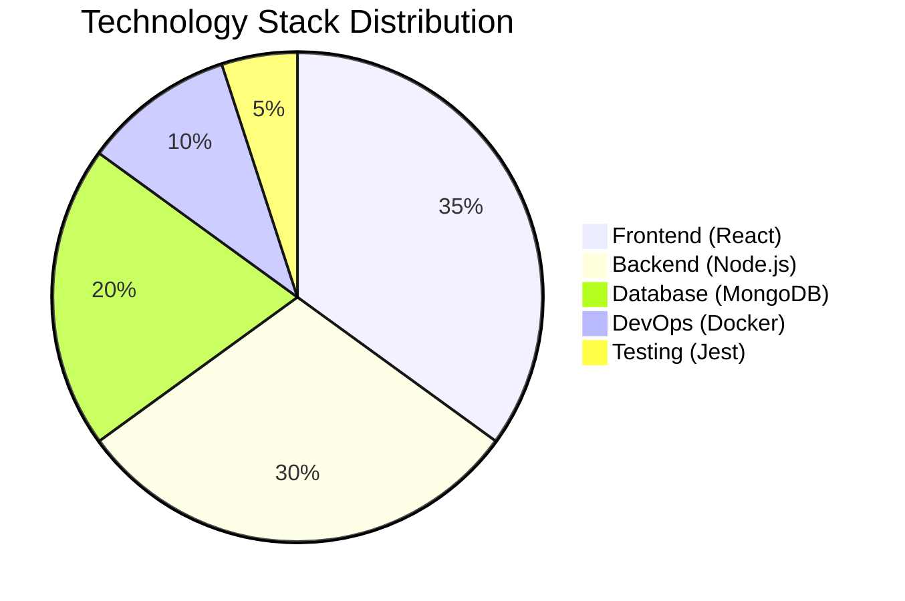
```mermaid
pie title Technology Stack Distribution
    "Frontend (React)" : 35
    "Backend (Node.js)" : 30
    "Database (MongoDB)" : 20
    "DevOps (Docker)" : 10
    "Testing (Jest)" : 5
```

## Mind Map Example
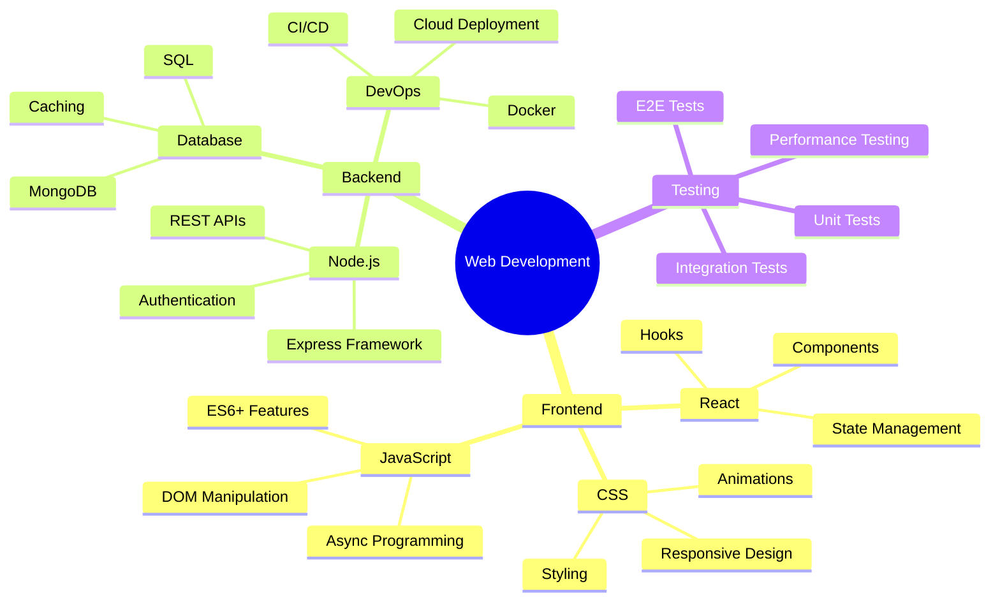
```mermaid
mindmap
  root((Web Development))
    Frontend
      React
        Components
        Hooks
        State Management
      CSS
        Styling
        Responsive Design
        Animations
      JavaScript
        ES6+ Features
        Async Programming
        DOM Manipulation
    Backend
      Node.js
        Express Framework
        REST APIs
        Authentication
      Database
        MongoDB
        SQL
        Caching
      DevOps
        Docker
        CI/CD
        Cloud Deployment
    Testing
      Unit Tests
      Integration Tests
      E2E Tests
      Performance Testing
```

## Entity Relationship Diagram
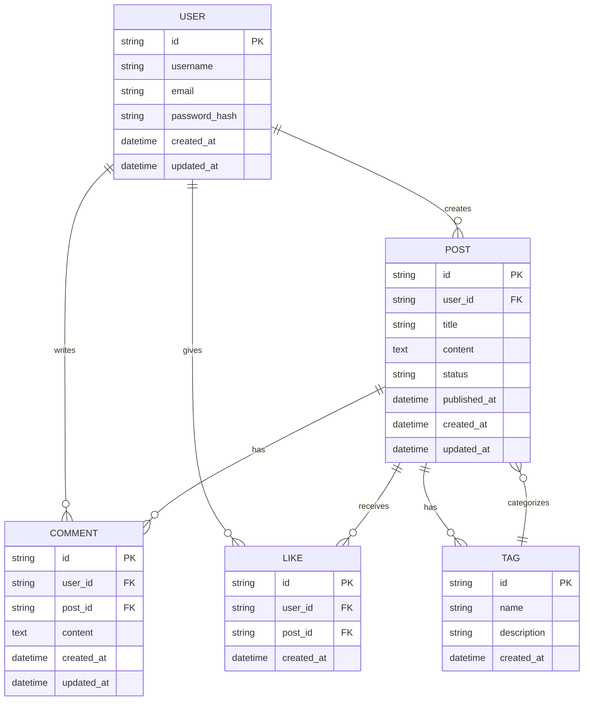
```mermaid
erDiagram
    USER ||--o{ POST : creates
    USER ||--o{ COMMENT : writes
    USER ||--o{ LIKE : gives
    POST ||--o{ COMMENT : has
    POST ||--o{ LIKE : receives
    POST ||--o{ TAG : has
    TAG ||--o{ POST : categorizes
    
    USER {
        string id PK
        string username
        string email
        string password_hash
        datetime created_at
        datetime updated_at
    }
    
    POST {
        string id PK
        string user_id FK
        string title
        text content
        string status
        datetime published_at
        datetime created_at
        datetime updated_at
    }
    
    COMMENT {
        string id PK
        string user_id FK
        string post_id FK
        text content
        datetime created_at
        datetime updated_at
    }
    
    LIKE {
        string id PK
        string user_id FK
        string post_id FK
        datetime created_at
    }
    
    TAG {
        string id PK
        string name
        string description
        datetime created_at
    }
```

## State Diagram Example
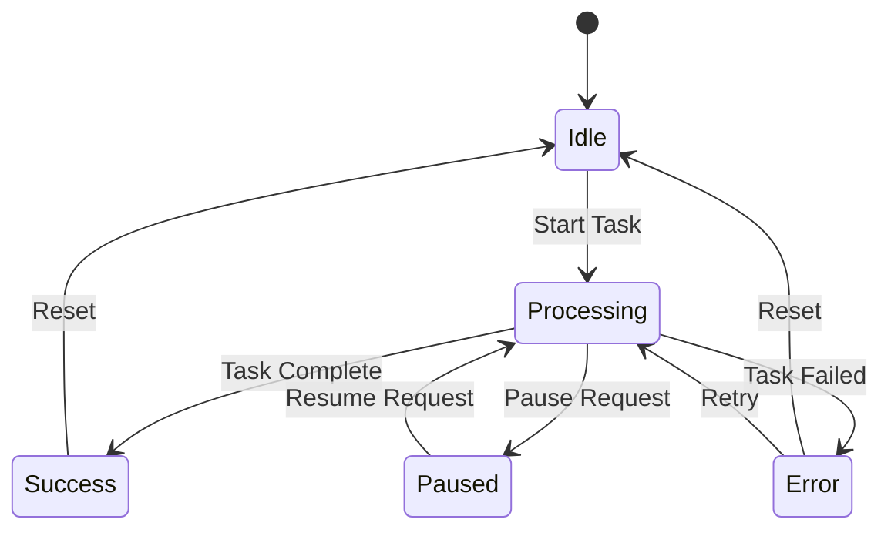
```mermaid
stateDiagram-v2
    [*] --> Idle
    Idle --> Processing : Start Task
    Processing --> Success : Task Complete
    Processing --> Error : Task Failed
    Processing --> Paused : Pause Request
    Paused --> Processing : Resume Request
    Success --> Idle : Reset
    Error --> Idle : Reset
    Error --> Processing : Retry
```

## Git Flow Example
```mermaid
gitgraph
    commit
    branch develop
    checkout develop
    commit
    commit
    checkout main
    merge develop
    commit
    checkout develop
    commit
    checkout feature-branch
    commit
    commit
    checkout develop
    merge feature-branch
    checkout main
    merge develop
```

## C4 Context Diagram
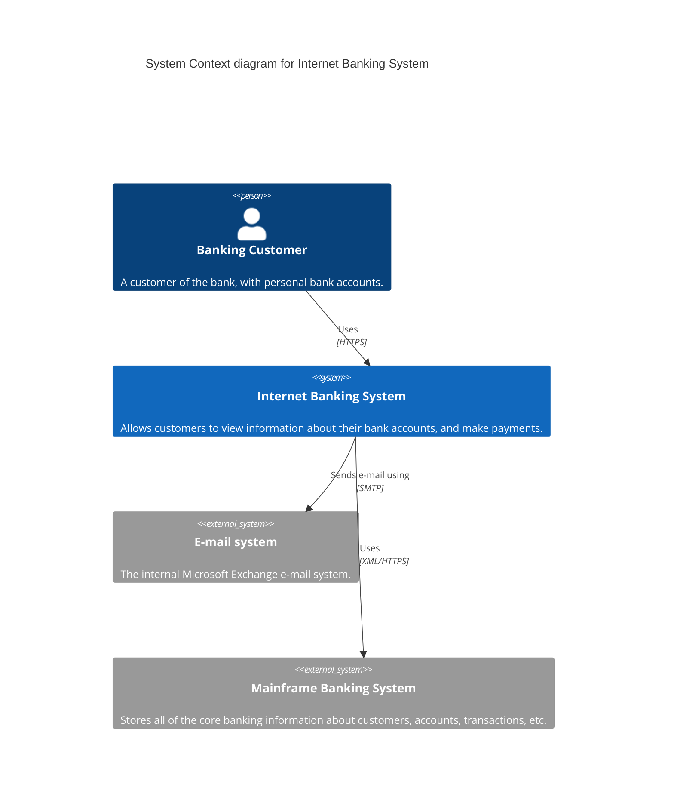
```mermaid
C4Context
    title System Context diagram for Internet Banking System
    
    Person(customer, "Banking Customer", "A customer of the bank, with personal bank accounts.")
    System(banking_system, "Internet Banking System", "Allows customers to view information about their bank accounts, and make payments.")
    
    Rel(customer, banking_system, "Uses", "HTTPS")
    
    System_Ext(mail_system, "E-mail system", "The internal Microsoft Exchange e-mail system.")
    System_Ext(mainframe, "Mainframe Banking System", "Stores all of the core banking information about customers, accounts, transactions, etc.")
    
    Rel(banking_system, mail_system, "Sends e-mail using", "SMTP")
    Rel(banking_system, mainframe, "Uses", "XML/HTTPS")
```

## Network Diagram Example
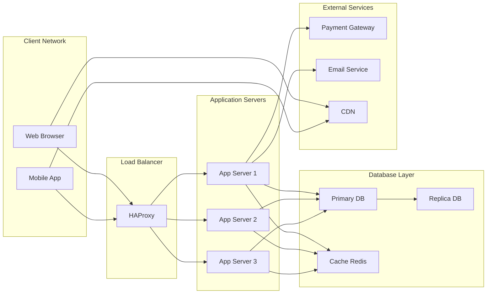
```mermaid
graph LR
    subgraph "Client Network"
        A[Web Browser]
        B[Mobile App]
    end
    
    subgraph "Load Balancer"
        C[HAProxy]
    end
    
    subgraph "Application Servers"
        D[App Server 1]
        E[App Server 2]
        F[App Server 3]
    end
    
    subgraph "Database Layer"
        G[Primary DB]
        H[Replica DB]
        I[Cache Redis]
    end
    
    subgraph "External Services"
        J[Payment Gateway]
        K[Email Service]
        L[CDN]
    end
    
    A --> C
    B --> C
    C --> D
    C --> E
    C --> F
    D --> G
    E --> G
    F --> G
    G --> H
    D --> I
    E --> I
    F --> I
    D --> J
    D --> K
    A --> L
    B --> L
```

## Kanban Board Example
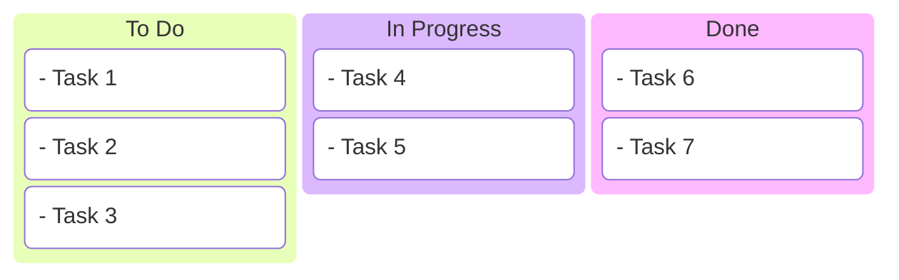
```mermaid
kanban
    To Do
        - Task 1
        - Task 2
        - Task 3
    In Progress
        - Task 4
        - Task 5
    Done
        - Task 6
        - Task 7
```

## Timeline Example
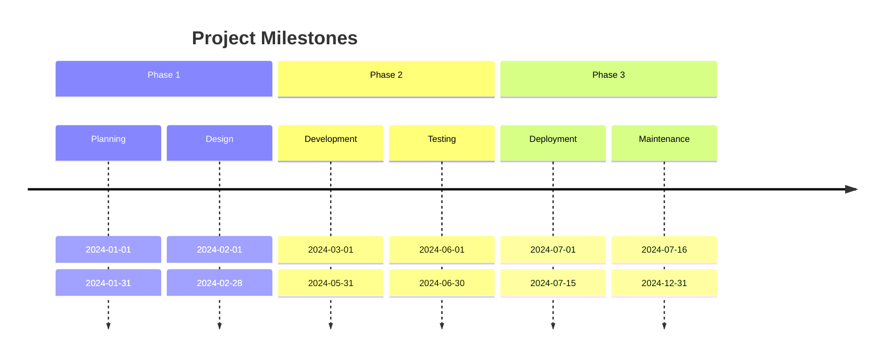
```mermaid
timeline
    title Project Milestones
    section Phase 1
        Planning : 2024-01-01 : 2024-01-31
        Design : 2024-02-01 : 2024-02-28
    section Phase 2
        Development : 2024-03-01 : 2024-05-31
        Testing : 2024-06-01 : 2024-06-30
    section Phase 3
        Deployment : 2024-07-01 : 2024-07-15
        Maintenance : 2024-07-16 : 2024-12-31
```

## Journey Map Example
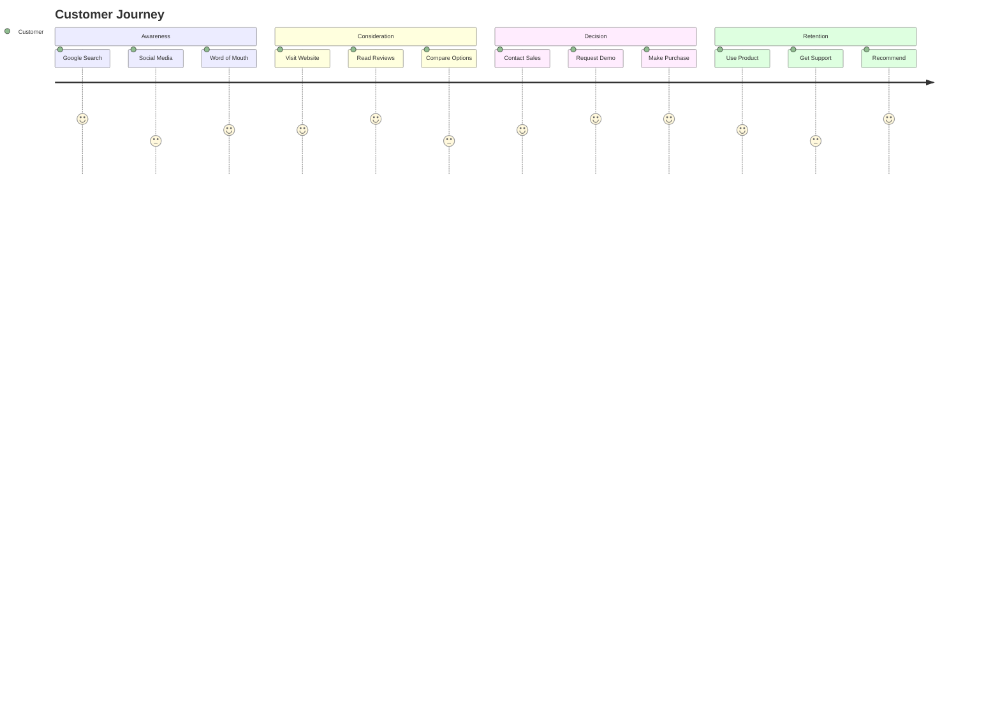
```mermaid
journey
    title Customer Journey
    section Awareness
        Google Search: 5: Customer
        Social Media: 3: Customer
        Word of Mouth: 4: Customer
    section Consideration
        Visit Website: 4: Customer
        Read Reviews: 5: Customer
        Compare Options: 3: Customer
    section Decision
        Contact Sales: 4: Customer
        Request Demo: 5: Customer
        Make Purchase: 5: Customer
    section Retention
        Use Product: 4: Customer
        Get Support: 3: Customer
        Recommend: 5: Customer
```

## Quadrant Chart Example
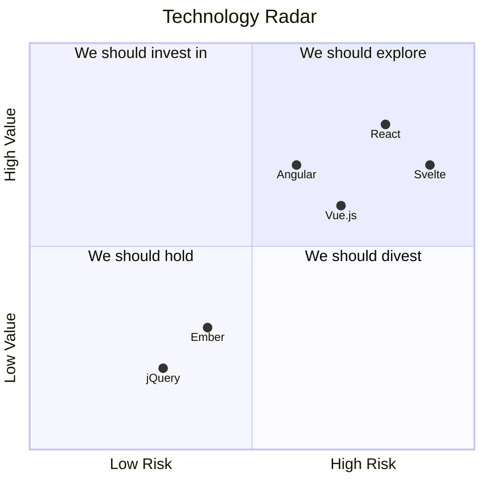
```mermaid
quadrantChart
    title Technology Radar
    x-axis Low Risk --> High Risk
    y-axis Low Value --> High Value
    quadrant-1 We should explore
    quadrant-2 We should invest in
    quadrant-3 We should hold
    quadrant-4 We should divest
    React: [0.8, 0.8]
    Angular: [0.6, 0.7]
    Vue.js: [0.7, 0.6]
    jQuery: [0.3, 0.2]
    Svelte: [0.9, 0.7]
    Ember: [0.4, 0.3]
```

## User Story Map Example
```mermaid
userStoryMap
    title E-commerce User Story Map
    As a customer
    I want to
    So that
    
    section Discovery
        Browse products
        Search for items
        Filter by category
        View product details
        Read reviews
        Compare products
    
    section Purchase
        Add to cart
        View cart
        Update quantities
        Apply discounts
        Choose shipping
        Enter payment
        Complete order
    
    section Post-Purchase
        Track order
        Receive notifications
        Download invoice
        Return items
        Write reviews
        Get support
```

## Requirements Traceability Matrix
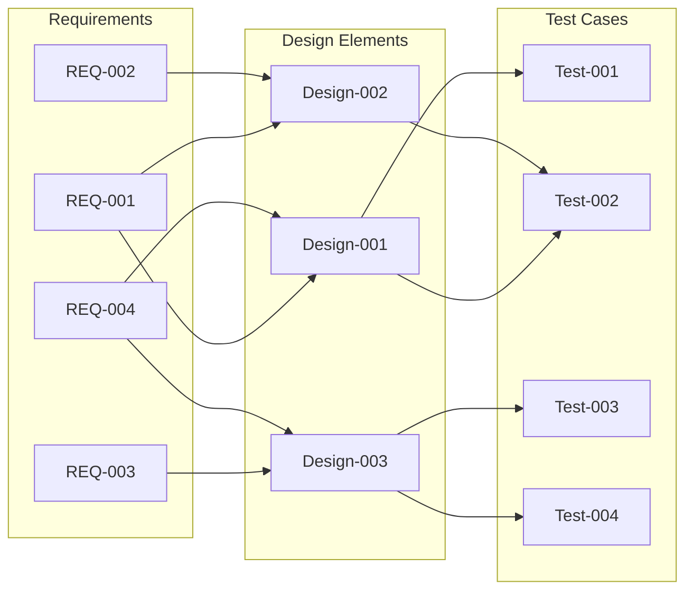
```mermaid
graph LR
    subgraph "Requirements"
        R1[REQ-001]
        R2[REQ-002]
        R3[REQ-003]
        R4[REQ-004]
    end
    
    subgraph "Design Elements"
        D1[Design-001]
        D2[Design-002]
        D3[Design-003]
    end
    
    subgraph "Test Cases"
        T1[Test-001]
        T2[Test-002]
        T3[Test-003]
        T4[Test-004]
    end
    
    R1 --> D1
    R1 --> D2
    R2 --> D2
    R3 --> D3
    R4 --> D1
    R4 --> D3
    
    D1 --> T1
    D1 --> T2
    D2 --> T2
    D3 --> T3
    D3 --> T4
```

## System Architecture Example
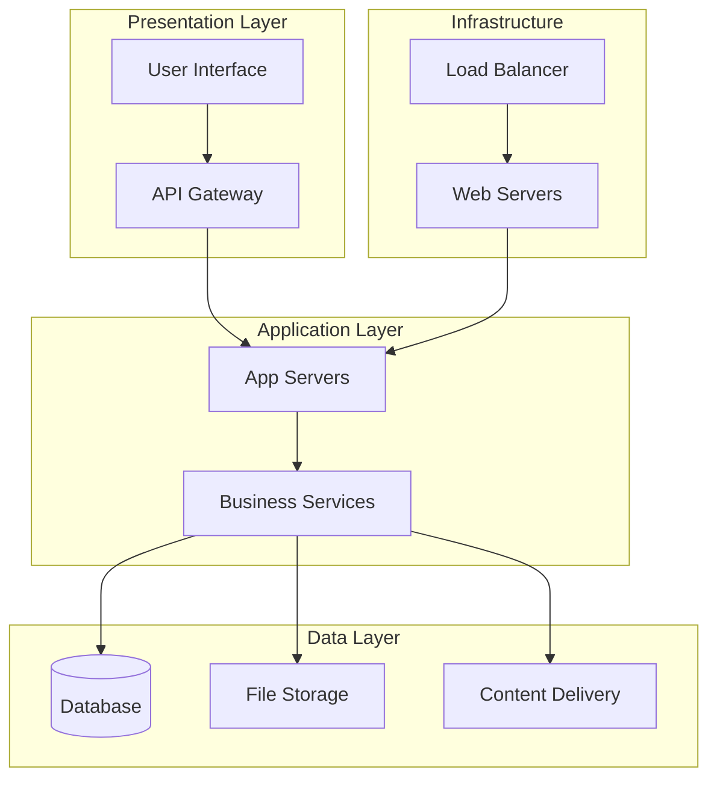
```mermaid
graph TB
    subgraph "Presentation Layer"
        UI[User Interface]
        API[API Gateway]
    end
    
    subgraph "Application Layer"
        AS[Application Services]
        BS[Business Services]
    end
    
    subgraph "Data Layer"
        DB[(Database)]
        FS[File Storage]
        CDN[Content Delivery]
    end
    
    subgraph "Infrastructure"
        LB[Load Balancer]
        WS[Web Servers]
        AS[App Servers]
    end
    
    UI --> API
    API --> AS
    AS --> BS
    BS --> DB
    BS --> FS
    BS --> CDN
    
    LB --> WS
    WS --> AS
```

## Data Flow Diagram Example
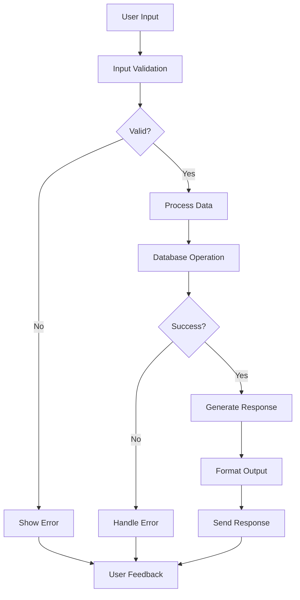
```mermaid
flowchart TD
    A[User Input] --> B[Input Validation]
    B --> C{Valid?}
    C -->|No| D[Show Error]
    C -->|Yes| E[Process Data]
    E --> F[Database Operation]
    F --> G{Success?}
    G -->|No| H[Handle Error]
    G -->|Yes| I[Generate Response]
    I --> J[Format Output]
    J --> K[Send Response]
    
    D --> L[User Feedback]
    H --> L
    K --> L
```

## Use Case Diagram Example
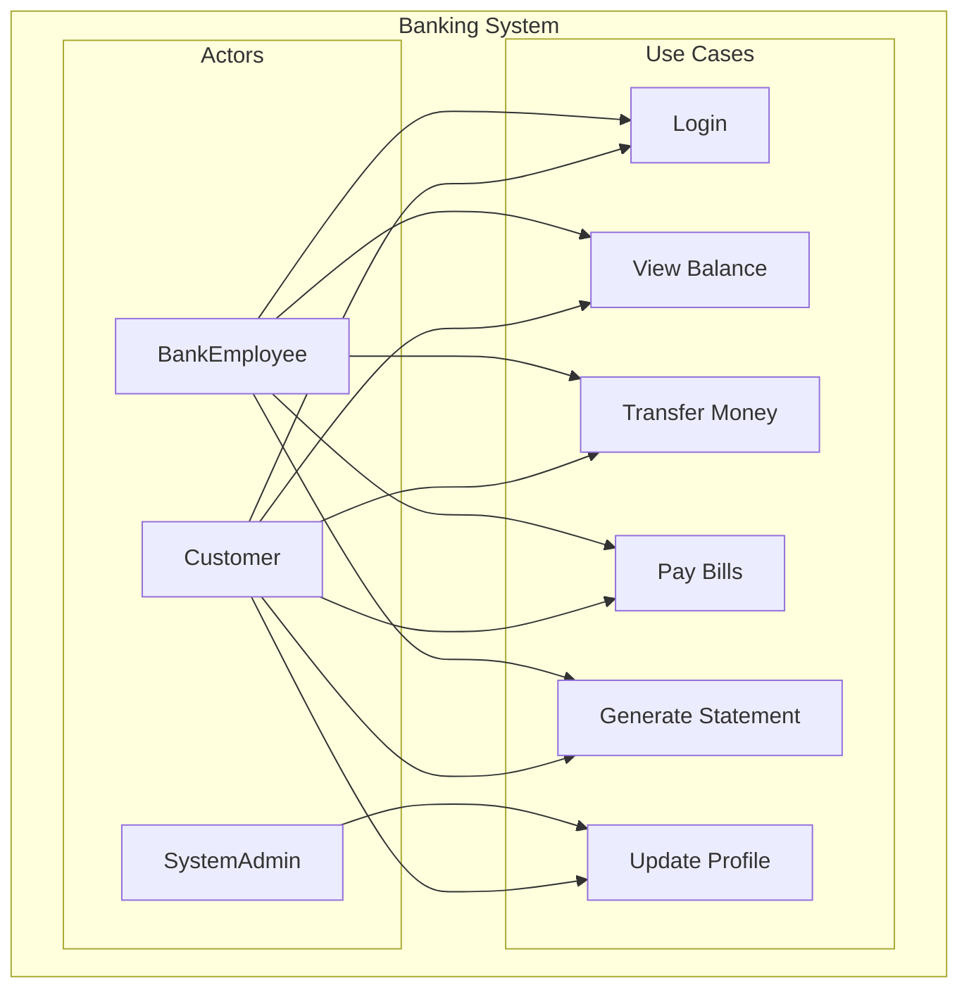
```mermaid
graph TD
    subgraph "Banking System"
        subgraph "Actors"
            Customer
            BankEmployee
            SystemAdmin
        end
        
        subgraph "Use Cases"
            UC1[Login]
            UC2[View Balance]
            UC3[Transfer Money]
            UC4[Pay Bills]
            UC5[Generate Statement]
            UC6[Update Profile]
        end
        
        Customer --> UC1
        Customer --> UC2
        Customer --> UC3
        Customer --> UC4
        Customer --> UC5
        Customer --> UC6
        
        BankEmployee --> UC1
        BankEmployee --> UC2
        BankEmployee --> UC3
        BankEmployee --> UC4
        BankEmployee --> UC5
        
        SystemAdmin --> UC6
    end
```

## Component Diagram Example
```mermaid
graph TB
    subgraph "Frontend Components"
        Header[Header Component]
        Sidebar[Sidebar Component]
        Main[Main Content]
        Footer[Footer Component]
    end
    
    subgraph "Backend Services"
        AuthService[Authentication Service]
        UserService[User Management Service]
        DataService[Data Processing Service]
        NotificationService[Notification Service]
    end
    
    subgraph "External APIs"
        PaymentAPI[Payment Gateway API]
        EmailAPI[Email Service API]
        StorageAPI[Cloud Storage API]
    end
    
    Header --> AuthService
    Sidebar --> UserService
    Main --> DataService
    Footer --> NotificationService
    
    AuthService --> PaymentAPI
    UserService --> EmailAPI
    DataService --> StorageAPI
```

## Deployment Diagram Example
```mermaid
graph TB
    subgraph "Development Environment"
        DevApp[Dev App Server]
        DevDB[(Dev Database)]
        DevCache[Dev Redis Cache]
    end
    
    subgraph "Staging Environment"
        StagingApp[Staging App Server]
        StagingDB[(Staging Database)]
        StagingCache[Staging Redis Cache]
    end
    
    subgraph "Production Environment"
        ProdLB[Production Load Balancer]
        ProdApp1[Prod App Server 1]
        ProdApp2[Prod App Server 2]
        ProdDB[(Production Database)]
        ProdCache[Production Redis Cache]
        ProdCDN[CDN]
    end
    
    DevApp --> DevDB
    DevApp --> DevCache
    
    StagingApp --> StagingDB
    StagingApp --> StagingCache
    
    ProdLB --> ProdApp1
    ProdLB --> ProdApp2
    ProdApp1 --> ProdDB
    ProdApp2 --> ProdDB
    ProdApp1 --> ProdCache
    ProdApp2 --> ProdCache
    ProdApp1 --> ProdCDN
    ProdApp2 --> ProdCDN
```

## Activity Diagram Example
```mermaid
graph TD
    A[Start] --> B[Initialize System]
    B --> C[Load Configuration]
    C --> D{Config Valid?}
    D -->|No| E[Log Error]
    E --> F[Exit]
    D -->|Yes| G[Start Services]
    G --> H[Initialize Database]
    H --> I{DB Connected?}
    I -->|No| J[Retry Connection]
    J --> H
    I -->|Yes| K[Start Web Server]
    K --> L[Wait for Requests]
    L --> M{Request Received?}
    M -->|No| L
    M -->|Yes| N[Process Request]
    N --> O[Send Response]
    O --> L
```

## Package Diagram Example
```mermaid
graph TD
    subgraph "com.example.app"
        subgraph "controller"
            UserController
            ProductController
            OrderController
        end
        
        subgraph "service"
            UserService
            ProductService
            OrderService
        end
        
        subgraph "repository"
            UserRepository
            ProductRepository
            OrderRepository
        end
        
        subgraph "model"
            User
            Product
            Order
        end
        
        subgraph "util"
            ValidationUtil
            DateUtil
            StringUtil
        end
    end
    
    UserController --> UserService
    ProductController --> ProductService
    OrderController --> OrderService
    
    UserService --> UserRepository
    ProductService --> ProductRepository
    OrderService --> OrderRepository
    
    UserRepository --> User
    ProductRepository --> Product
    OrderRepository --> Order
    
    UserService --> ValidationUtil
    ProductService --> DateUtil
    OrderService --> StringUtil
```

## Object Diagram Example
```mermaid
graph TD
    subgraph "User Objects"
        U1[user1: User<br/>id: "U001"<br/>name: "John Doe"<br/>email: "john@example.com"]
        U2[user2: User<br/>id: "U002"<br/>name: "Jane Smith"<br/>email: "jane@example.com"]
    end
    
    subgraph "Product Objects"
        P1[product1: Product<br/>id: "P001"<br/>name: "Laptop"<br/>price: 999.99]
        P2[product2: Product<br/>id: "P002"<br/>name: "Mouse"<br/>price: 29.99]
    end
    
    subgraph "Order Objects"
        O1[order1: Order<br/>id: "O001"<br/>total: 1029.98<br/>status: "Pending"]
    end
    
    U1 -->|creates| O1
    U2 -->|views| P1
    U2 -->|views| P2
    O1 -->|contains| P1
    O1 -->|contains| P2
```

## Communication Diagram Example
```mermaid
sequenceDiagram
    participant A as Client
    participant B as Server
    participant C as Database
    participant D as External API
    
    A->>B: HTTP Request
    B->>C: Query Data
    C-->>B: Return Data
    B->>D: API Call
    D-->>B: API Response
    B-->>A: HTTP Response
    
    Note over A,D: This shows the communication<br/>flow between all components
```

## Interaction Overview Diagram Example
```mermaid
graph TD
    A[Start] --> B[Initialize]
    B --> C[Main Process]
    C --> D{User Action?}
    D -->|Yes| E[Process User Input]
    D -->|No| F[Wait]
    E --> G[Update State]
    G --> H[Render UI]
    H --> C
    F --> C
    
    subgraph "Error Handling"
        I[Error Occurs]
        J[Log Error]
        K[Show Error Message]
        L[Recover State]
    end
    
    C --> I
    I --> J
    J --> K
    K --> L
    L --> C
```

## Timing Diagram Example
```mermaid
sequenceDiagram
    participant A as Client
    participant B as Server
    participant C as Database
    
    Note over A,C: Timing Diagram Example
    
    A->>B: Request (t=0ms)
    B->>C: Query (t=50ms)
    C-->>B: Response (t=150ms)
    B-->>A: Reply (t=200ms)
    
    Note over A: Client waits 200ms total
    Note over B: Server processes in 150ms
    Note over C: Database responds in 100ms
```

## Robustness Diagram Example
```mermaid
graph TD
    subgraph "Boundary Objects"
        LoginForm[Login Form]
        Dashboard[Dashboard View]
        ErrorPage[Error Page]
    end
    
    subgraph "Control Objects"
        LoginController[Login Controller]
        SessionManager[Session Manager]
        ErrorHandler[Error Handler]
    end
    
    subgraph "Entity Objects"
        User[User Entity]
        Session[Session Entity]
        Log[Log Entity]
    end
    
    LoginForm --> LoginController
    LoginController --> User
    LoginController --> SessionManager
    SessionManager --> Session
    SessionManager --> Dashboard
    ErrorHandler --> ErrorPage
    ErrorHandler --> Log
```

## Composite Structure Diagram Example
```mermaid
graph TD
    subgraph "E-commerce System"
        subgraph "Web Interface"
            Header[Header Component]
            Navigation[Navigation Bar]
            Content[Content Area]
            Footer[Footer Component]
        end
        
        subgraph "Business Logic"
            OrderProcessor[Order Processor]
            PaymentHandler[Payment Handler]
            InventoryManager[Inventory Manager]
        end
        
        subgraph "Data Access"
            OrderDAO[Order Data Access]
            ProductDAO[Product Data Access]
            UserDAO[User Data Access]
        end
        
        Header --> Navigation
        Navigation --> Content
        Content --> Footer
        
        Content --> OrderProcessor
        Content --> PaymentHandler
        Content --> InventoryManager
        
        OrderProcessor --> OrderDAO
        PaymentHandler --> OrderDAO
        InventoryManager --> ProductDAO
        OrderProcessor --> UserDAO
    end
```

## Profile Diagram Example
```mermaid
graph TD
    subgraph "Custom Profile"
        subgraph "Stereotypes"
            <<Service>>
            <<Repository>>
            <<Controller>>
            <<Entity>>
        end
        
        subgraph "Tagged Values"
            Version[version: "1.0"]
            Author[author: "Team A"]
            Priority[priority: "High"]
        end
        
        subgraph "Constraints"
            MustBeValid[valid: "Must be valid"]
            MustBeUnique[unique: "Must be unique"]
        end
    end
```

## Template Example
```mermaid
graph TD
    subgraph "Template Pattern"
        AbstractClass[<<abstract>> AbstractClass<br/>+templateMethod()<br/>+primitiveOperation1()<br/>+primitiveOperation2()]
        
        ConcreteClass[ConcreteClass<br/>+primitiveOperation1()<br/>+primitiveOperation2()]
        
        AbstractClass --> ConcreteClass
    end
```

## Note: This is a comprehensive test file with many Mermaid diagram types!
You can copy any of these examples and paste them into your Mermaid Diagram Renderer page to test different diagram types and see how they render.

Each diagram demonstrates different Mermaid syntax and capabilities, from simple flowcharts to complex system architectures.
